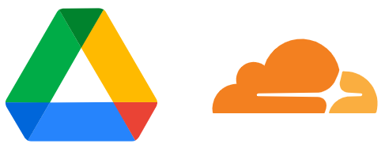

使用 Cloudflare Workers 为 Google Drive 提供 WebDAV 支持

WebDAV supports for Google Drive using Cloudflare Workers

__功能开发中 / This project is under development.__

__Due to other important things, the project will be developed after April__

## 主要功能

| |WebDAV Methods|请求处理方法|Google Drive 接口|
|---:|:---:|:---|:---|
|√|OPTIONS 获取支持选项|options()|/|
| |PROPFIND 获取资源属性或目录层次结构|propfind(path, depth)|**TBD**|
| |PROPPATCH 更改/删除资源属性|**TBD**|**TBD**|
| |MKCOL 新建目录|mkcol(path)|mkdir(path)|
| |GET 获取文件内容|get(path, range)|fetchFile(path, range)|
| |HEAD|head(path)|**TBD**|
| |DELETE 删除文件/目录|unlink(path)|unlink(path)|
| |PUT 修改文件内容|**TBD**|**TBD**|
| |COPY 复制文件/目录|**TBD**|**TBD**|
| |MOVE 移动/重命名文件/目录|move(src, dest)|**TBD**|
| |LOCK 锁定文件/目录|lock(path)|**暂不支持**|
|√|UNLOCK 解锁文件/目录|unlock()|**暂不支持**|

## TODO

- [ ] 添加部署文档
- [ ] 参考 RFC 4918 修改已有的 WebDAV 文档
- [x] 考虑到 WebDAV 客户端是可靠的，逐步移除部分异常处理代码
- [ ] 为缩略图添加代理（https://x.x.workers.dev/?proxy=xxx，参考 [SunYufei/cf-workers-collection/cors](https://github.com/SunYufei/cf-workers-collection/tree/master/cors)）

## 文档 / Docs

1. [Google Drive API](doc/Google%20Drive%20API.md)
2. [WebDAV Methods](doc/WebDAV.md)

## 参考内容 / References

1. [Google Drive API v3](https://developers.google.com/drive)
2. [RFC 4918](http://www.webdav.org/specs/rfc4918.html) (WebDAV revision)
3. [RFC 2518](http://www.webdav.org/specs/rfc2518.html) (First WebDAV spec)
4. [WebDAV Methods | Microsoft Docs](https://docs.microsoft.com/en-us/previous-versions/office/developer/exchange-server-2003/aa142917(v=exchg.65))

## 许可 / License

[MIT License](LICENSE)
